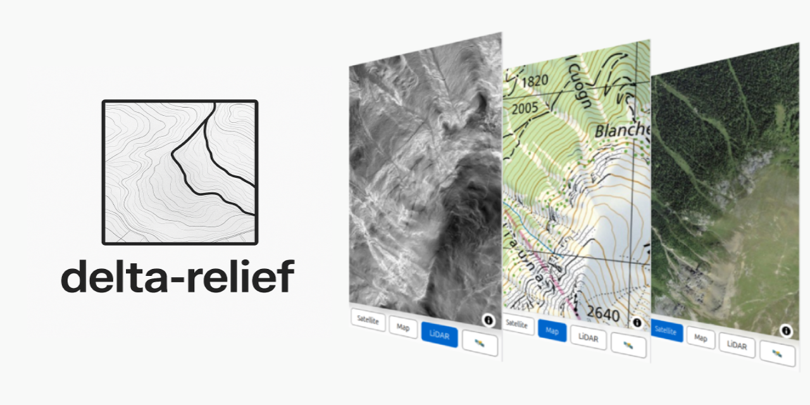

# delta-relief
High-resolution surface analysis with LiDAR data

## Introduction

Airborne LiDAR uses hundreds of thousands of laser pulses per second to generate detailed 3D maps, even through vegetation.
With point densities of several per square meter, 10 cm accuracy, and high speed, it is among the most effective methods for mapping topography.

Source [SwissTopo](https://www.swisstopo.admin.ch/en/lidar-data-swisstopo)

The Swiss Federal Office of Topography (Swisstopo) provides a highly precise digital elevation model based on LiDAR data, 
called [swissALTI3D](https://www.swisstopo.admin.ch/en/height-model-swissalti3d). Buildings and vegetation are removed, revealing
the underlying topography.

The data is delivered as a GeoTIFF tiles with 2000px × 2000px resolution representing 1km × 1km areas (resolution of 0.5m).
The full list of all tiles is provided [here](ch.swisstopo.swissalti3d.csv).

> [!NOTE]
> Swisstopo uses the [Swiss coordinates system LV95](https://www.swisstopo.admin.ch/en/the-swiss-coordinates-system), aka. EPSG:2056.

LiDAR has some interesting use cases in archaeology ([Caspari, 2023](https://www.mdpi.com/2072-4292/15/6/1569)), 
particularly for uncovering man-made structures that are hidden beneath vegetation or subtle terrain changes.
It allows archaeologists to identify features such as ancient roads, walls, building foundations, and agricultural
terraces that may be invisible to the naked eye or conventional aerial photography.

## Goal of this Project

This project aims to improve accessibility to the data in two main steps:
- Visualize the SwissTopo data as images that highlight subtle terrain changes for easier interpretation
- Deploy the data in an interactive, mobile-friendly online map

Currently, part of this data of eastern Switzerland (North Graubünden) is accessible on https://lidar.cubetrek.com

The online map allows to quickly pan to the current location via GPS and switch between three different map layers
(LiDAR, this project; Aerial View and Map View, data from SwissTopo).

## Points of Interest

Some examples of interesting features in the covered area (North Graubünden). 

> [!NOTE]
> Help me extend this list! Send a pull request or mail to: [contact@cubetrek.com](mailto:contact@cubetrek.com) if
> you know of any other interesting examples.

See also the Jupyter Notebook ([delta-relief-notebook.ipynb](delta-relief-notebook.ipynb)) for more examples in other places of Switzerland.

### Colm La Runga

Remains of a roman camp sitting at an altitude of 2200 m ASL. Likely around 15 BC, marking the start of the Roman occupation of this area of the Alps.

The camp was discovered in 2024, and was partly an inspiration of this project, as LiDAR data was also used to help in the discovery.

Sources:
- Picture source: [Kanton Graubünden](https://www.gr.ch/DE/Medien/Mitteilungen/MMStaka/2024/Seiten/2024082903.aspx)
- [Swiss Info: Remains of Roman camp discovered in eastern Switzerland](https://www.swissinfo.ch/eng/science/resounding-discovery-of-the-remains-of-a-roman-camp-in-graub%C3%BCnden/87459159)
- [Swiss Info: Swiss Roman battle site reveals hidden secrets of historic clash](https://www.swissinfo.ch/eng/sci-&-tech/swiss-roman-battle-site-reveals-hidden-secrets-of-historic-clash/49004988)

### Rohanschanze (Rohan's fortification)

Built during the Thirty Years' War (1635) by the French Duke of Rohan. Only the earthwork remains.

Sources:
- [Burgenverein Untervaz, PDF, German](https://download.burgenverein-untervaz.ch/downloads/dorfgeschichte/1639-Die%20Rohanschanze%20und%20ihre%20Schleifung.pdf)
- [Rohanschanze, Wikipedia, German](https://de.wikipedia.org/wiki/Rohanschanze)

### Cresta Settlement in Cazis

Bronze Age settlement situated on a hilltop, the settlement was continuously inhabited for approximately 500 to 600 years
during the Early to Middle Bronze Age (circa 2000–1300 BCE).
Excavations have uncovered multiple layers of occupation, revealing structures such as post-built houses, hearths, and storage pits.

Sources:
- [Sonderheft Archäologischer Dienst Graubünden, PDF, German](https://www.somedia-buchverlag.ch/wp-content/uploads//download-sonderheft_5_leseprobe.pdf)
- [Cresta-Siedlung, Wikipedia, German](https://de.wikipedia.org/wiki/Cresta-Siedlung)

## Technical Details

### Visualization of LiDAR data

