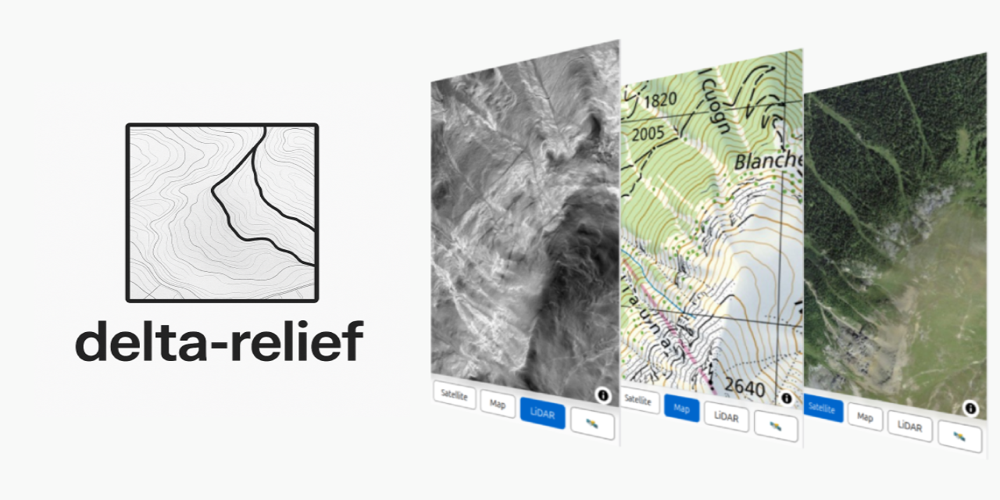

# delta-relief
High-resolution surface analysis with LiDAR data

## Introduction

Airborne LiDAR uses hundreds of thousands of laser pulses per second to generate detailed 3D maps, even through vegetation.
With high point densities and 10 cm accuracy, it is among the most effective methods for mapping topography.


Source [SwissTopo](https://www.swisstopo.admin.ch/en/lidar-data-swisstopo)

The Swiss Federal Office of Topography (Swisstopo) provides a highly precise digital elevation model based on LiDAR data, 
called [swissALTI3D](https://www.swisstopo.admin.ch/en/height-model-swissalti3d). Buildings and vegetation are removed, revealing
the underlying topography.

The data is delivered as a GeoTIFF tiles with 2000px × 2000px resolution representing 1km × 1km areas (resolution of 0.5m).
The full list of all tiles is provided [here](ch.swisstopo.swissalti3d.csv).

> [!NOTE]
> Swisstopo uses the [Swiss coordinates system LV95](https://www.swisstopo.admin.ch/en/the-swiss-coordinates-system), aka. EPSG:2056.

LiDAR has some interesting use cases in archaeology ([Caspari, 2023](https://www.mdpi.com/2072-4292/15/6/1569)), 
particularly for uncovering man-made structures that are hidden beneath vegetation or subtle terrain changes.
It allows archaeologists to identify features such as ancient roads, walls, building foundations, and agricultural
terraces that may be invisible to the naked eye or conventional aerial photography.

## Goal of this Project

This project aims to improve accessibility to the data in two main steps:
- Visualize the SwissTopo data as images that highlight subtle terrain changes for easier interpretation
- Deploy the data in an interactive, mobile-friendly online map

Currently, part of this data of eastern Switzerland (North Graubünden) is accessible on https://lidar.cubetrek.com

[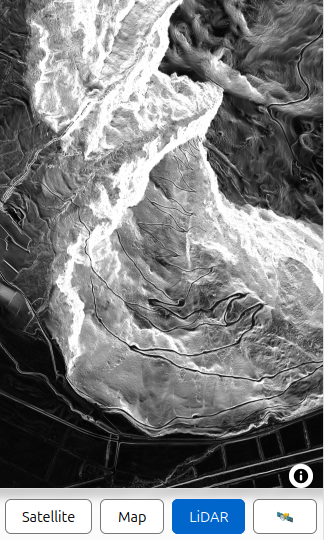](https://lidar.cubetrek.com)

The online map allows to quickly pan to the current location via GPS and switch between three different map layers
(LiDAR, this project; Aerial View and Map View, data from SwissTopo).

## Points of Interest

Some examples of interesting features in the covered area (North Graubünden). 

> [!NOTE]
> Help me extend this list! Send a pull request or mail to: [contact@cubetrek.com](mailto:contact@cubetrek.com) if
> you know of any other interesting examples.

See also the Jupyter Notebook ([delta-relief-notebook.ipynb](delta-relief_examples.ipynb)) for more examples in other places of Switzerland.

### Colm La Runga
[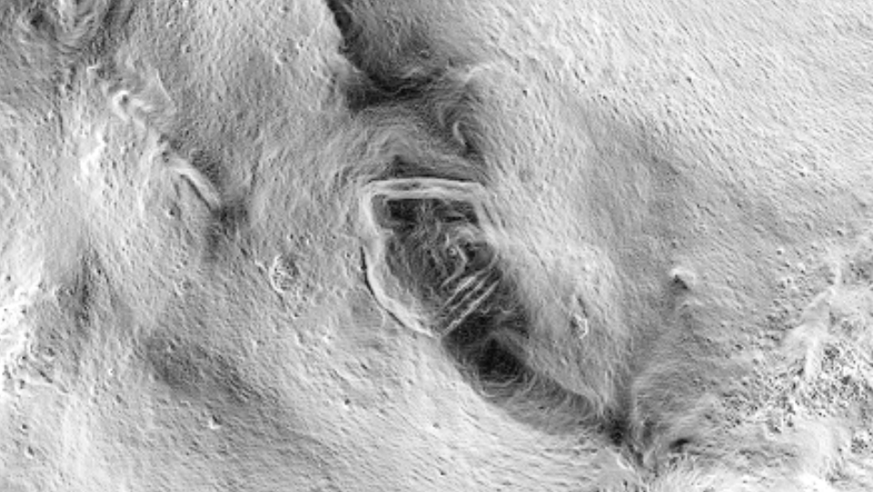](https://lidar.cubetrek.com/?lat=46.635453&lon=9.610046)

Remains of a roman camp sitting at an altitude of 2200 m ASL. Likely around 15 BC, marking the start of the Roman occupation of this area of the Alps.

The camp was discovered in 2024, and was partly an inspiration of this project, as LiDAR data was also used to help in the discovery.


Sources:
- Picture source: [Kanton Graubünden](https://www.gr.ch/DE/Medien/Mitteilungen/MMStaka/2024/Seiten/2024082903.aspx)
- [Swiss Info: Remains of Roman camp discovered in eastern Switzerland](https://www.swissinfo.ch/eng/science/resounding-discovery-of-the-remains-of-a-roman-camp-in-graub%C3%BCnden/87459159)
- [Swiss Info: Swiss Roman battle site reveals hidden secrets of historic clash](https://www.swissinfo.ch/eng/sci-&-tech/swiss-roman-battle-site-reveals-hidden-secrets-of-historic-clash/49004988)

### Rohanschanze (Rohan's fortification)

Built during the Thirty Years' War (1635) by the French Duke of Rohan. Only the earthwork remains.

[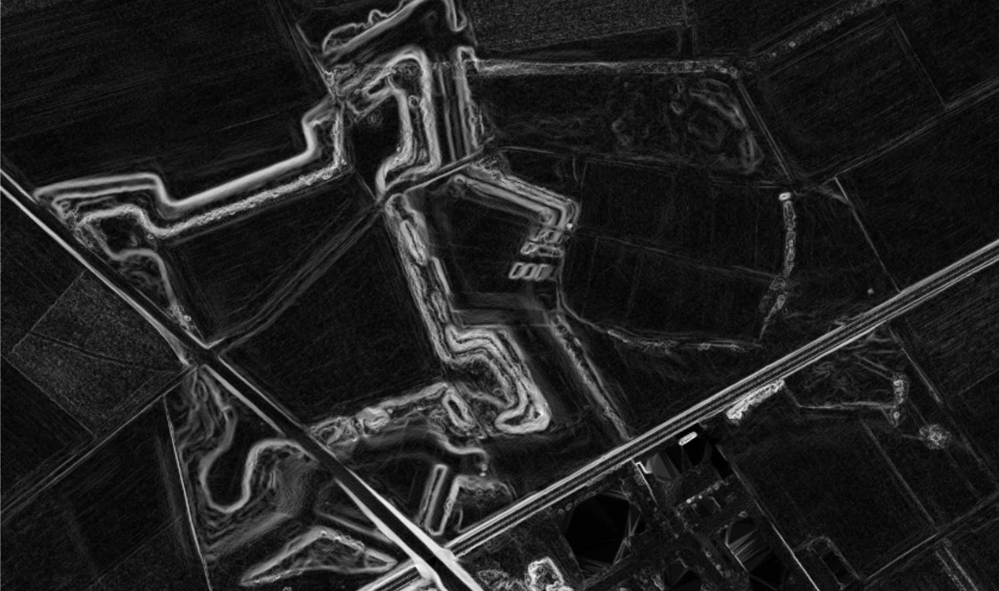](https://lidar.cubetrek.com/?lat=46.974573&lon=9.557507)

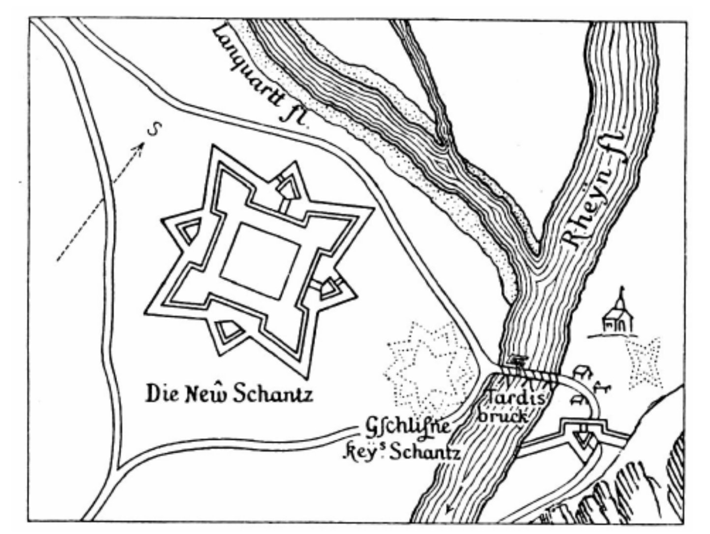

Sources:
- [Burgenverein Untervaz, PDF, German](https://download.burgenverein-untervaz.ch/downloads/dorfgeschichte/1639-Die%20Rohanschanze%20und%20ihre%20Schleifung.pdf)
- [Rohanschanze, Wikipedia, German](https://de.wikipedia.org/wiki/Rohanschanze)


### Cresta Settlement in Cazis
[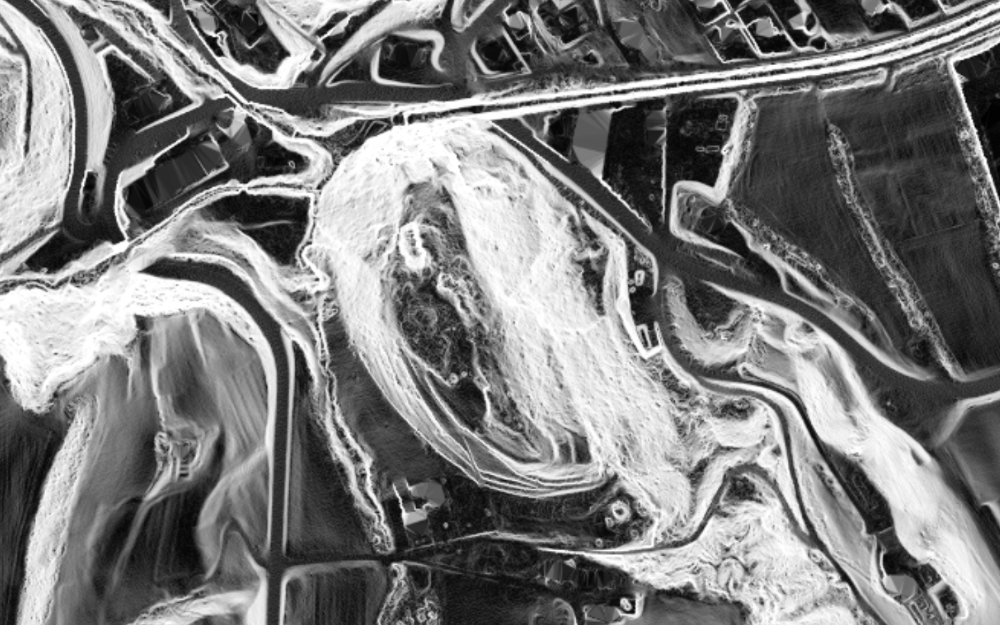](https://lidar.cubetrek.com/?lat=46.711225&lon=9.430793)


Bronze Age settlement situated on a hilltop, the settlement was continuously inhabited for approximately 500 to 600 years
during the Early to Middle Bronze Age (circa 2000–1300 BCE).
Excavations have uncovered multiple layers of occupation, revealing structures such as post-built houses, hearths, and storage pits.

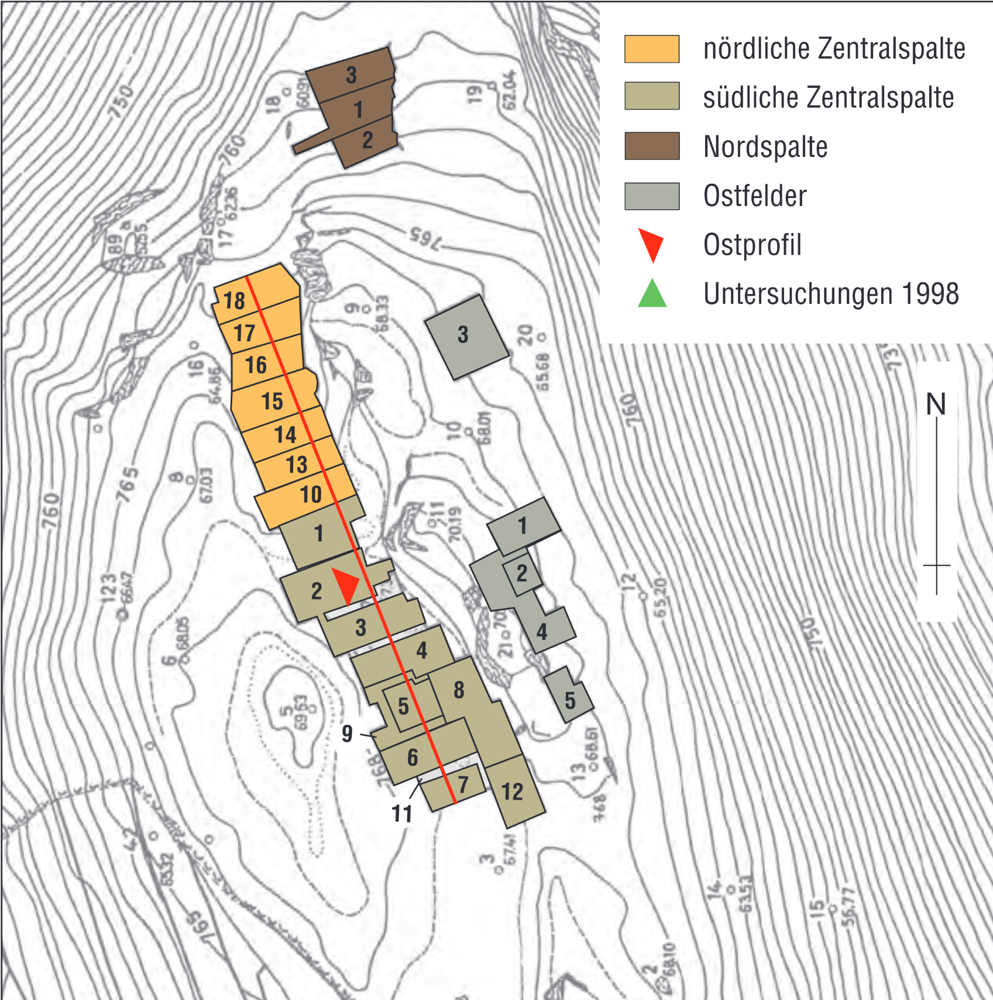


Sources:
- [Sonderheft Archäologischer Dienst Graubünden, PDF, German](https://www.somedia-buchverlag.ch/wp-content/uploads//download-sonderheft_5_leseprobe.pdf)
- [Cresta-Siedlung, Wikipedia, German](https://de.wikipedia.org/wiki/Cresta-Siedlung)


## Technical Details

### Visualization of LiDAR data

The figures below are created in the [Visualization trials Jupyter Notebook](delta-relief_visualization_trials.ipynb).

To demonstrate how to display subtle terrain changes in the best way, we use two examples:
the Rohanschanze on the left illustrates clearly visible earthworks in flat terrain, while the
Colm La Runga on the right highlights more subtle features in a mountainous landscape.

The input data consists of absolute elevation values (height above sea level). A basic way to visualize this is as a
grayscale gradient-black representing the lowest and white the highest altitude within each tile.

While the fort is visible, the Roman camp gets completely lost in the surrounding mountainous terrain.

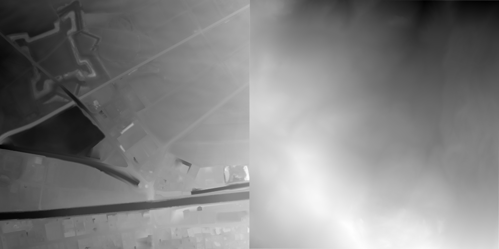

n scientific visualizations, elevation data is often rendered using *hillshading*.

This produces a natural-looking terrain representation, but it requires significant tuning to make subtle features
visible, especially in hilly terrain. (I couldn't manage for the Roman camp). So it's not ideal for our purposes.

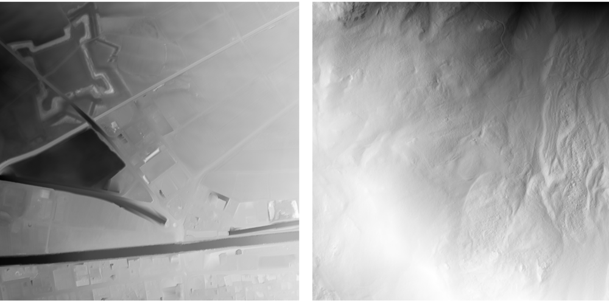

Our focus is not on absolute elevation, but on detecting subtle terrain variations.

To achieve this, we compute the slope at each point: an approximation of the first derivative along both axes.

This yields significantly finer details, and the Roman camp becomes clearly visible (centered in the lower left quadrant).

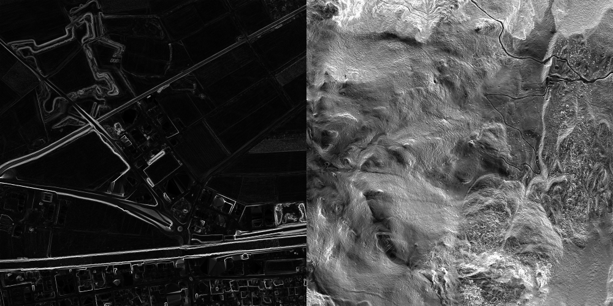

To enhance subtle variations even further, we apply a non-linear transformation to the slope values: fine gradients are exaggerated while steeper slopes remain mostly unchanged.

This strikes a good balance: broad features remain visible, and fine details become much clearer. In mountainous areas, the output becomes brighter overall, but with some getting used to, more structure can be perceived.

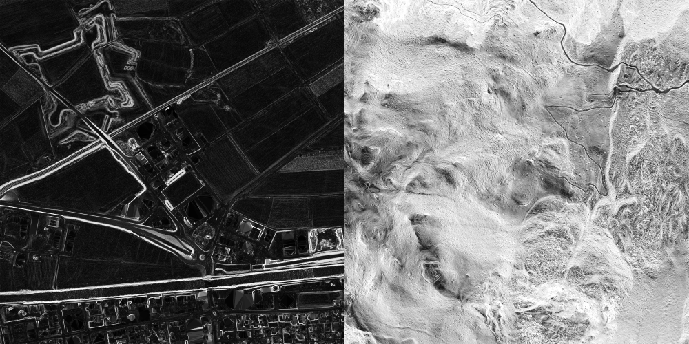

We can also go a step further and run another differentiation (basically a second derivative), in the hope to uncover more details.

However, this primarily amplifies noise and yields no real improvement.

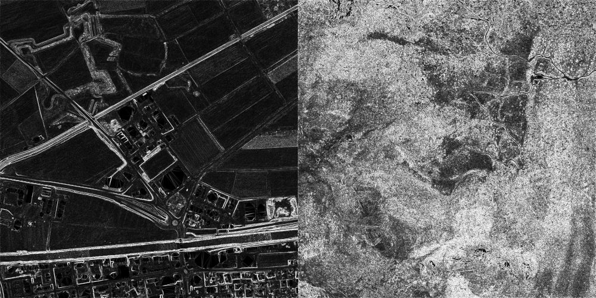

Going back to the first derivative, we can apply a colormap to encode the slope magnitude.

This approach works well in relatively flat regions (e.g. the first example), but becomes visually overwhelming in complex, mountainous terrain, where everything tends to shift towards red.

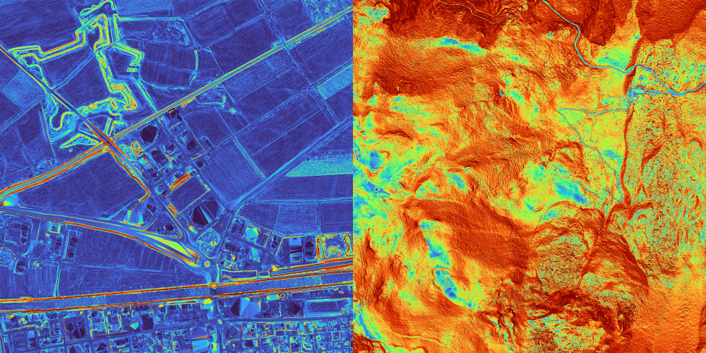


### Hosting the data

[mbtileserver](https://github.com/consbio/mbtileserver) provides an easy way to
host *mbtiles* so that they can be used as a map layer in [MapLibre JS](https://maplibre.org/).

To create the mbtiles file, we

- run the [create_geotiff.py](create_geotiff.py) script to download the GeoTiffs, convert the data as described above and save it as GeoTiff again
- use [GDAL](https://gdal.org/en/stable/index.html) to build the mbtiles file while converting the GeoTIFF from LVB95 (the Swiss coordinates system) to Web Mercator (EPSG:3857).

```
gdalbuildvrt -a_srs EPSG:2056 lv95.vrt calculated/*.tif
gdalwarp -s_srs EPSG:2056 -t_srs EPSG:3857 -tap -tr 0.5 0.5 -r bilinear -co COMPRESS=DEFLATE -co TILED=YES -co BIGTIFF=YES lv95.vrt webmerc.tif
gdal_translate -of MBTILES webmerc.tif lidar.mbtiles
gdaladdo -r average lidar.mbtiles 2 4 8 16
```

NGINX is used as a reverse proxy to relay between the client and the mbtileserver and also to host the static
[index file](index.html), that uses MabLibre JS.


